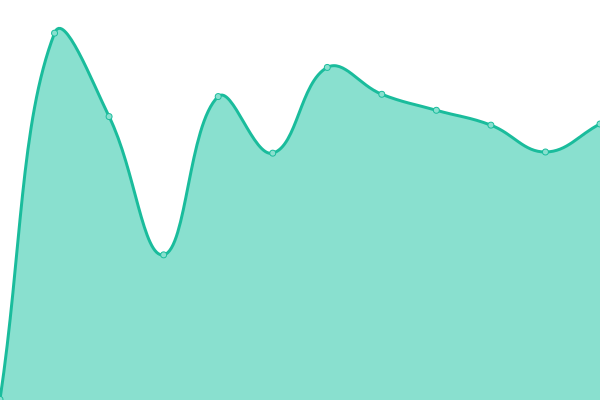
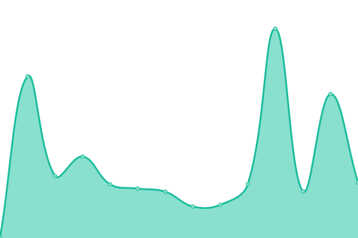

# [📈 Live Status](https://status.obl.ong): <!--live status--> **🟩 All systems operational**

This repository contains the open-source uptime monitor and status page for [Obl.ong](https://obl.ong), powered by [Upptime](https://github.com/upptime/upptime).

With [Upptime](https://upptime.js.org), you can get your own unlimited and free uptime monitor and status page, powered entirely by a GitHub repository. We use [Issues](https://github.com/obl-ong/status/issues) as incident reports, [Actions](https://github.com/obl-ong/status/actions) as uptime monitors, and [Pages](https://status.obl.ong) for the status page.

<!--start: status pages-->
<!-- This summary is generated by Upptime (https://github.com/upptime/upptime) -->
<!-- Do not edit this manually, your changes will be overwritten -->
<!-- prettier-ignore -->
| URL | Status | History | Response Time | Uptime |
| --- | ------ | ------- | ------------- | ------ |
|  [Admin](https://admin.obl.ong/up) | 🟩 Up | [admin.yml](https://github.com/obl-ong/status/commits/HEAD/history/admin.yml) | 

 478ms
     
 | 

<a href="https://status.obl.ong/history/admin">99.65%</a>
    

|  [Landing](https://obl.ong) | 🟩 Up | [landing.yml](https://github.com/obl-ong/status/commits/HEAD/history/landing.yml) | 

 765ms
     
 | 

<a href="https://status.obl.ong/history/landing">99.66%</a>
    

|  [Forum](https://forum.obl.ong) | 🟩 Up | [forum.yml](https://github.com/obl-ong/status/commits/HEAD/history/forum.yml) | 

 881ms
     
 | 

<a href="https://status.obl.ong/history/forum">99.67%</a>
    

<!--end: status pages-->

[**Visit our status website →**](https://status.obl.ong)

## 📄 License

- Powered by: [Upptime](https://github.com/upptime/upptime)
- Code: [MIT](./LICENSE) © [Anand Chowdhary](https://anandchowdhary.com), supported by [Pabio](https://pabio.com)
- Data in the `./history` directory: [Open Database License](https://opendatacommons.org/licenses/odbl/1-0/)
